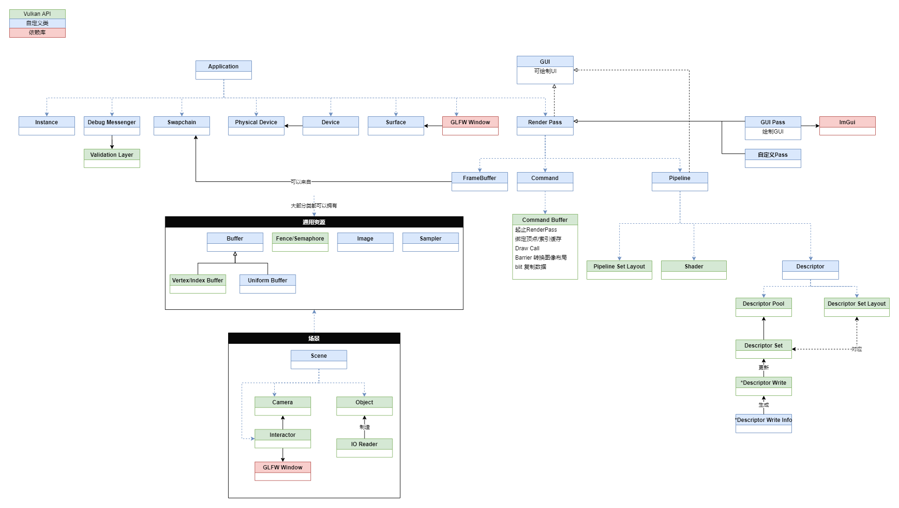

# 金源引擎渲染器
## 结果对比
- 游戏截图

- 渲染器截图


## 基础功能
- 读取并渲染map文件 ✅已完成
- 读取并渲染rmf文件
  - 解析wad文件 ✅已完成
  - 解析spr文件 ✅已完成
  - 解析mdl文件 🚀开发中，完成部分
- 读取并渲染bsp文件(固体+实体) ✅已完成
  - 实现实体特殊渲染
    - 点实体渲染为方块 
    - 特殊点实体渲染
      - 图标渲染 ✅已完成
    - 模型渲染 🚀开发中
- 编辑器
  - 物体选取
  - 物体变换
  - 实体设置
    - FGD配置 🚀开发中
  - 保存文件
## 其他功能（画🍕）
- 高级渲染效果 🚀开发中
  - PBR
    - 实时PBR管线
    - IBL 图像照明
- bsp实体触发机制与效果
- 解析、播放地图音频
- 读取并渲染dem文件
## 依赖
- 所有C++依赖均通过vkpkg安装，使用64位版本
  - 图形API：vulkan （官网下载安装配置环境变量VULKAN_SDK为Vulkan根目录）
  - GUI库：glfw+imgui
    - file dialog文件选择框基于 https://github.com/AirGuanZ/imgui-filebrowser
    	- 进行了重构，删除了不需要的功能
  - 数学库：glm
  - 图片IO：stb_image (.jpg, .bmp, .png, .tag...), tinyexr (.exr)
- （可选）Python，编译Shader的脚本，如果要绕过Python实现自动编译详见compileShader.py

- 安装
  - 首先安装vcpkg https://vcpkg.io/en/getting-started.html 
  - 添加环境变量VCPKG_DEFAULT_TRIPLET=x64-windows
    - 修改默认安装64位版，否则默认是32位
    - 否则每条install末尾要加上:x64-windows，如
    ```
    vcpkg install glm:x64-windows
    ```
  - 重启控制台，输入
  ```
  vcpkg install vulkan
  vcpkg install glm
  vcpkg install glfw3
  vcpkg install imgui[core,vulkan-binding,glfw-binding]
  vcpkg install stb
  vcpkg install tinyexr

  vcpkg integrate install
  ```
  > 注意Vulkan并非下载源码安装，而是回去寻找本地已安装的SDK，因此需要自己下载安装后，配置好VULKAN_SDK环境变量
  > 详见：https://github.com/microsoft/vcpkg/blob/master/ports/vulkan/usage

## 架构图
- Vulkan调用流程图

- 数据流程图

- 模块依赖
