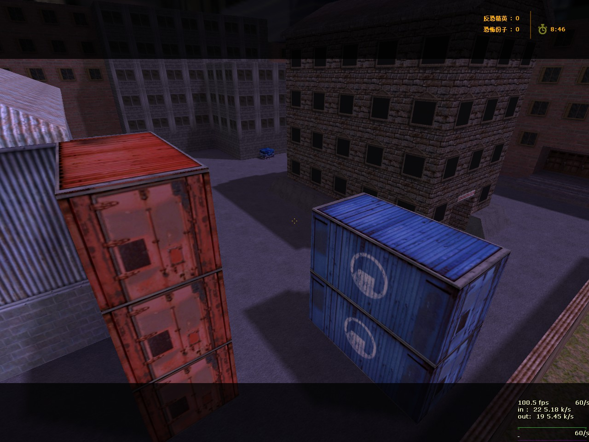
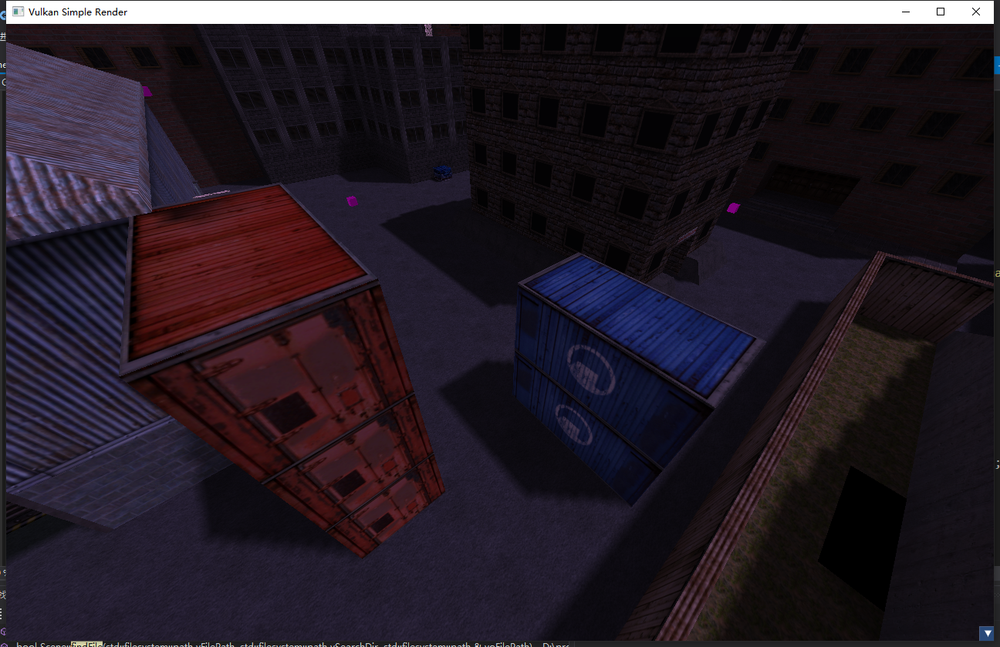
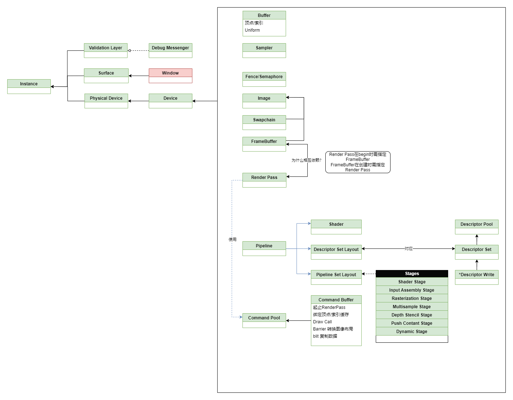
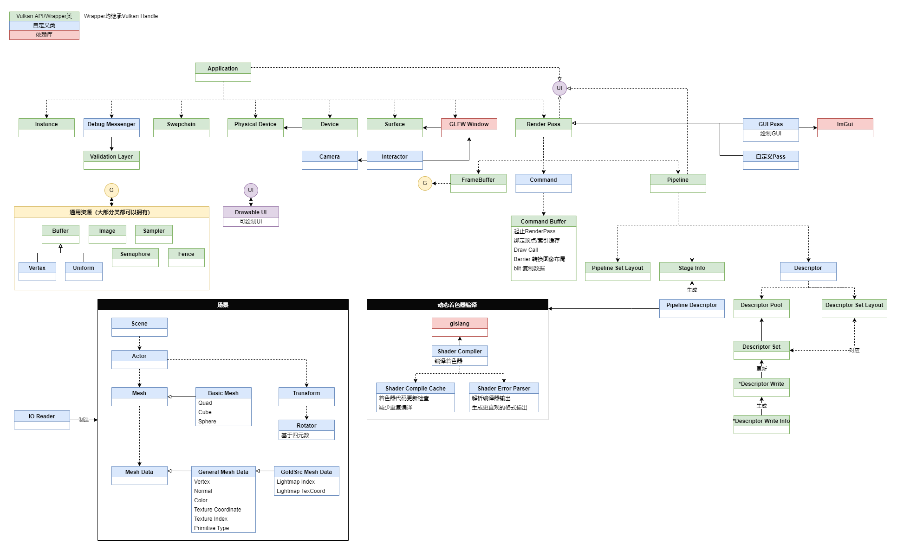
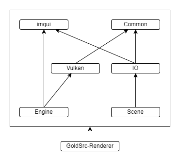
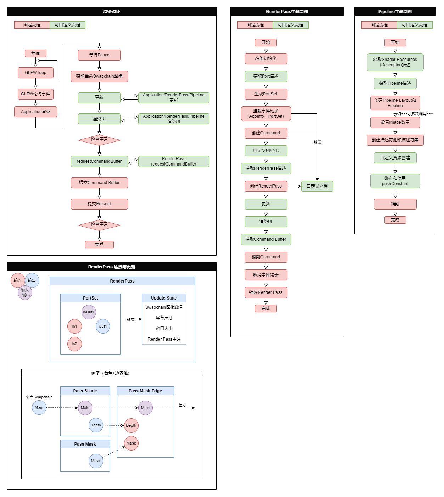

# 金源引擎渲染器
## 结果对比
- 游戏截图

- 渲染器截图


## 基础功能
- 渲染
  - 读取并渲染map文件 ✅已完成
  - 读取并渲染rmf文件
    - 解析wad文件 ✅已完成
    - 解析spr文件 ✅已完成
    - 解析mdl文件 ⏸暂停，完成部分
  - 读取并渲染bsp文件(固体+实体) ✅已完成
    - 实现实体特殊渲染
      - 点实体渲染为方块 ✅已完成
      - 特殊点实体渲染
        - Sprite图标渲染 ✅已完成
        - 应用到场景中 ⏸暂停
      - 模型渲染 ⏸暂停
- 物理
  - 实现物理demo
    - 基础形状的定义
    - 刚体定义
    - 运动模拟
    - 碰撞检测与处理
- 编辑器与可视化
  - 物体选取
    - 选择
      - 点击选择 ✅已完成
    - 高亮显示 
      - bounding box ❌已弃用
      - 外轮廓 ✅已完成
  - 物体变换
  - 实体设置
    - FGD配置 ⏸暂停
    - 选取以查看实体信息
    - 3D HUD展示实体信息
  - 保存文件
    - 导出obj ✅已完成
## 其他功能（画🍕）
- 高级渲染效果 ⏸暂停
  - PBR
    - 实时PBR管线
    - IBL 图像照明
- bsp实体触发机制与效果
- 解析、播放地图音频
- 读取并渲染dem文件
## 依赖
- 所有C++依赖均通过vkpkg安装，使用64位版本
  - 图形API：vulkan （官网下载安装配置环境变量VULKAN_SDK为Vulkan根目录）
  - GUI库：glfw+imgui
    - file dialog文件选择框基于nativefiledialog
  - 数学库：glm
  - 图片IO：stb_image (.jpg, .bmp, .png, .tga...), tinyexr (.exr)

- 安装
  - 首先下载安装Vulkan https://github.com/microsoft/vcpkg/blob/master/ports/vulkan/usage
  - 然后安装vcpkg https://vcpkg.io/en/getting-started.html 
  - 添加环境变量VCPKG_DEFAULT_TRIPLET=x64-windows
    - 这样会变成默认安装64位版，否则默认是32位
    - 不添加环境变量的话，需要每条install末尾要加上:x64-windows来下载64位版本，如
    ```
    vcpkg install glm:x64-windows
    ```
  - 重启控制台，输入
  ```
  vcpkg install vulkan
  vcpkg install glm
  vcpkg install glfw3
  vcpkg install imgui[core,vulkan-binding,glfw-binding]
  vcpkg install stb
  vcpkg install tinyexr
  vcpkg install nativefiledialog

  vcpkg integrate install
  ```
  > 注意因为Vulkan并非下载源码安装，而是会去寻找本地已安装的SDK，所以才需要自己下载安装，此外安装后需要检查VULKAN_SDK环境变量是否正确

## 架构图
- Vulkan依赖图

- 数据流程图

- 模块依赖

- 渲染流程与生命周期图


## 遇到的有价值的问题
- [问题列表](./ProblemList.md)

## 一些用到的技术、算法
- [技术列表](./TechList.md)

## TODO
  - Debug scope功能
  - 最小化时，extent=(0,0)的处理
  - 三角形全部改为逆时针！
  - 碰撞分board和narrow
  - pipeline生命周期、renderpass生命周期
    - 绘制port相关的流程图，类型展示