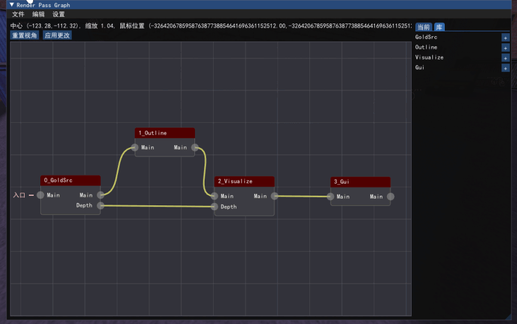
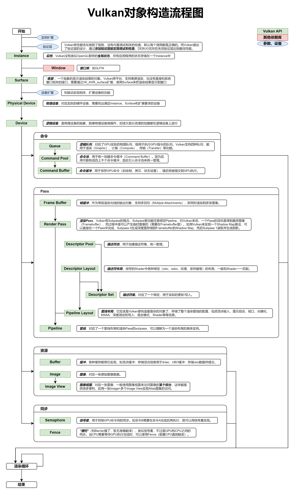
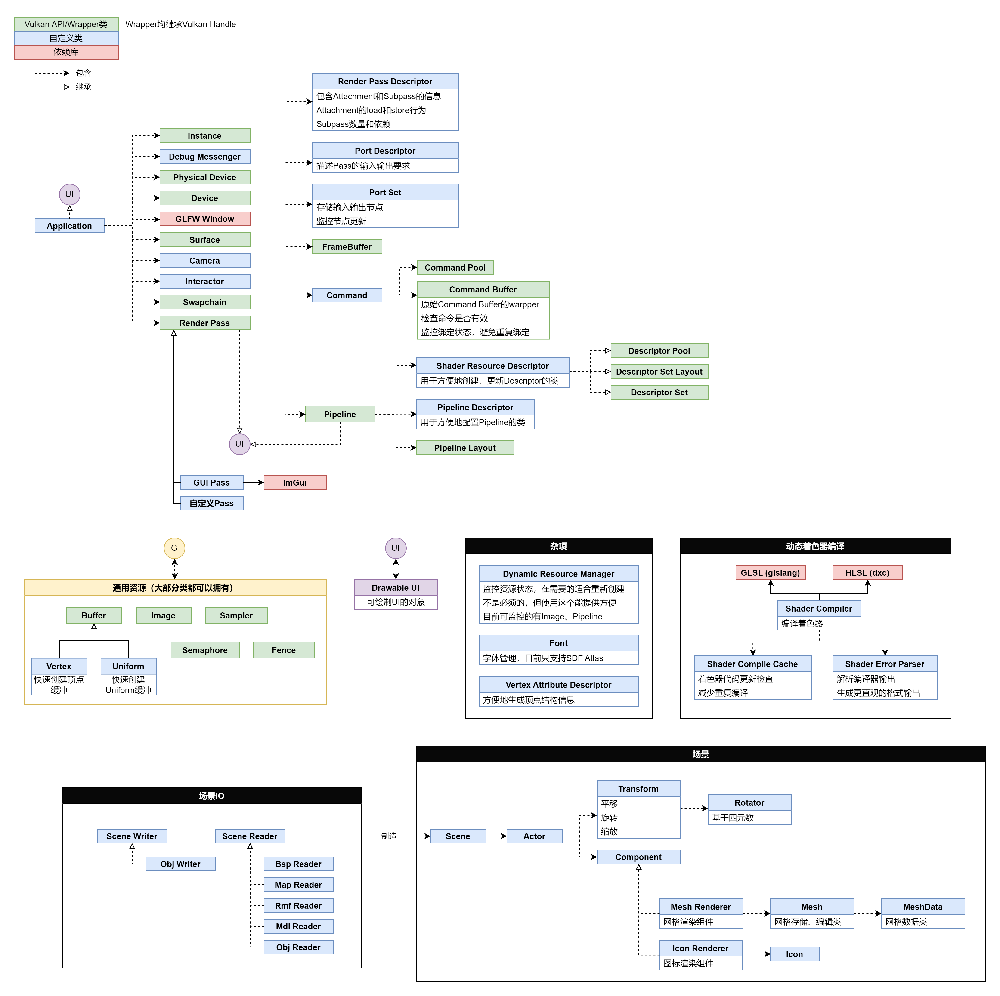
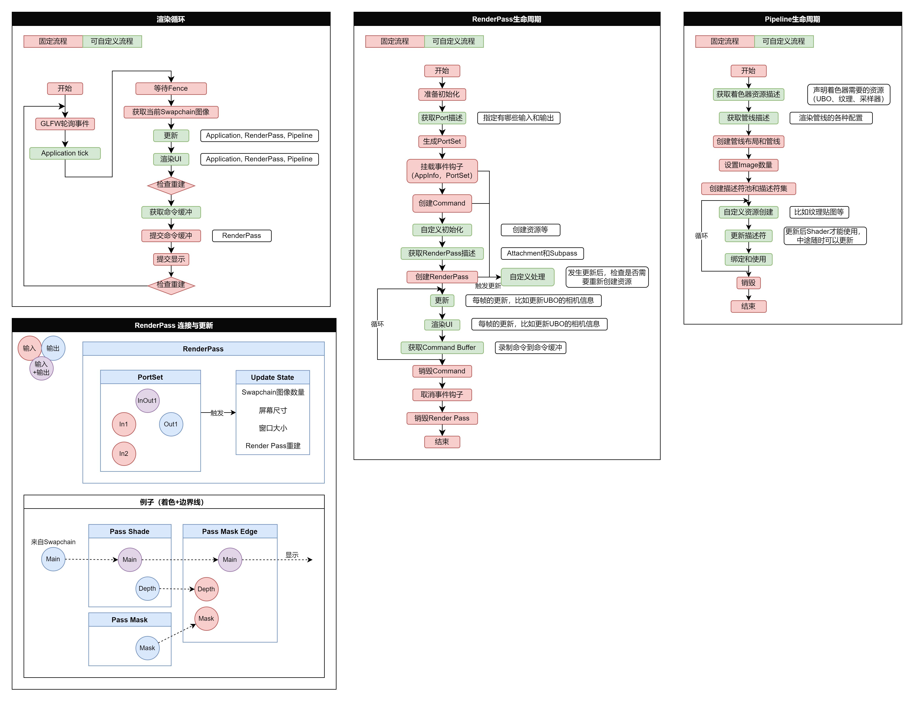
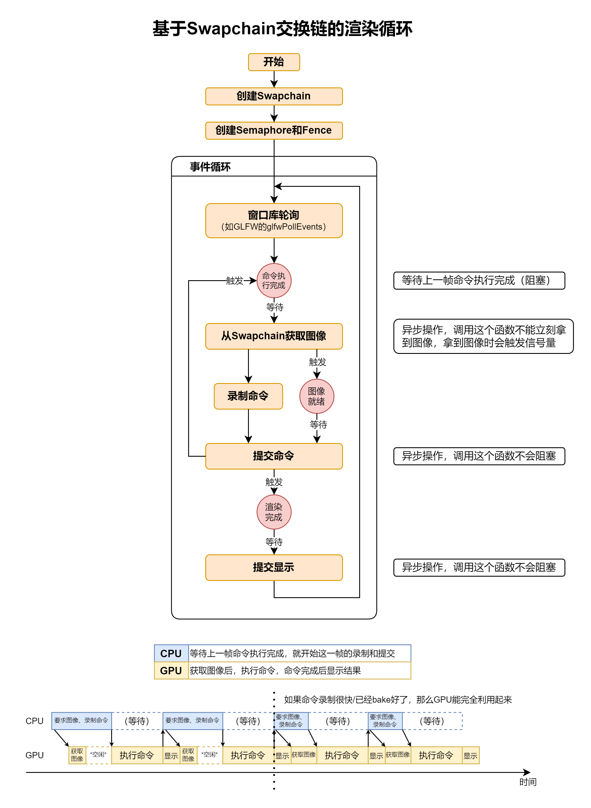

# 金源引擎渲染器
## 结果对比
- 游戏截图

- 渲染器截图


## 其他功能
- Renderpass Graph


## 基础功能
- 渲染
  - 读取并渲染map文件 ✅已完成
  - 读取并渲染rmf文件
    - 解析wad文件 ✅已完成
    - 解析spr文件 ✅已完成
    - 解析mdl文件 ⏸暂停，完成部分
  - 读取并渲染bsp文件(固体+实体) ✅已完成
    - 实现实体特殊渲染
      - 点实体渲染为方块 ✅已完成
      - 特殊点实体渲染
        - Sprite图标渲染 ✅已完成
        - 应用到场景中 ⏸暂停
      - 模型渲染 ⏸暂停
- 物理
  - 实现物理demo
    - 基础形状的定义
    - 刚体定义
    - 运动模拟
    - 碰撞检测与处理
- 编辑器与可视化
  - 物体选取
    - 选择
      - 点击选择 ✅已完成
    - 高亮显示 
      - bounding box ❌已弃用
      - 外轮廓 ✅已完成
  - 物体变换
  - 实体设置
    - FGD配置 ⏸暂停
    - 选取以查看实体信息
    - 3D HUD展示实体信息
  - 保存文件
    - 导出obj ✅已完成
  - 辅助显示
    - 图标渲染 ✅已完成
    - 文本渲染
      - ASCII ✅已完成
      - 中文字体
  - 渲染Pass图
    - 查看
    - 编辑
## 其他功能（画🍕）
- 高级渲染效果
  - PBR
    - 实时PBR管线
    - IBL 图像照明
    - 自发光
  - 多光源阴影
    - 聚光灯Shadow Map
    - 点光源Shadow Map
    - 级联Shadow Map
  - 光追Pass
  - 后处理Pass及其扩展设计
    - Bloom
    - 环境光遮蔽AO
      - SSAO
- bsp实体触发机制与效果
- 解析、播放地图音频
- 读取并渲染dem文件

## 架构图
- Vulkan构造流程图

- 类关系图

- 渲染流程与生命周期图

- 交换链渲染循环图


## 遇到的有价值的问题
这里记录了很多开发过程中遇到的问题，主要是整个渲染器架构设计上的问题。
- [问题列表](./ProblemList.md)

## 一些用到的技术、算法
这里记录了很多使用到的技术和算法，对其基本原理做了简单的介绍。
- [技术列表](./TechList.md)

## 依赖
- 项目主要由Visual Studio开发和管理，但方便跨平台提供了xmake版本
### VS
- 所有C++依赖均通过vkpkg安装，使用64位版本
  - 图形API：vulkan （官网下载安装配置环境变量VULKAN_SDK为Vulkan根目录）
  - GUI库：glfw+imgui
    - file dialog文件选择框基于nativefiledialog
  - 数学库：glm
  - 图片IO：stb_image (.jpg, .bmp, .png, .tga...), tinyexr (.exr)

- 安装
  - 首先下载安装Vulkan https://github.com/microsoft/vcpkg/blob/master/ports/vulkan/usage
  - 然后安装vcpkg https://vcpkg.io/en/getting-started.html 
  - 添加环境变量VCPKG_DEFAULT_TRIPLET=x64-windows
    - 这样会变成默认安装64位版，否则默认是32位
    - 不添加环境变量的话，需要每条install末尾要加上:x64-windows来下载64位版本，如
    ```
    vcpkg install glm:x64-windows
    ```
  - 重启控制台，输入
  ```
  vcpkg install vulkan
  vcpkg install glm
  vcpkg install glfw3
  vcpkg install imgui[core,vulkan-binding,glfw-binding]
  vcpkg install stb
  vcpkg install tinyexr
  vcpkg install nativefiledialog

  vcpkg integrate install
  ```
  > 注意因为Vulkan并非下载源码安装，而是会去寻找本地已安装的SDK，所以才需要自己下载安装，此外安装后需要检查VULKAN_SDK环境变量是否正确

### Xmake
- 详见xmake.lua
- xmake大部分没有强制指定使用vcpkg的源
  - 除了imgui，xmake似乎只给了imgui的核心，没有给binding，这在vcpkg里是通过feature功能可选安装实现的
  - 此外需要注意，xrepo中的包名称和vcpkg中可能不一样
    - 如vcpkg中叫vulkan，而xrepo里叫vulkansdk

## TODO
  - Debug scope功能
  - 碰撞分board和narrow
  - GLSL → HLSL
    - https://github.com/KhronosGroup/Vulkan-Guide/blob/main/chapters/hlsl.adoc
  - renderpass graph的可视化
  - _ASSERTE(xx.isValid())改为check，汇报不满足的地方，方便定位